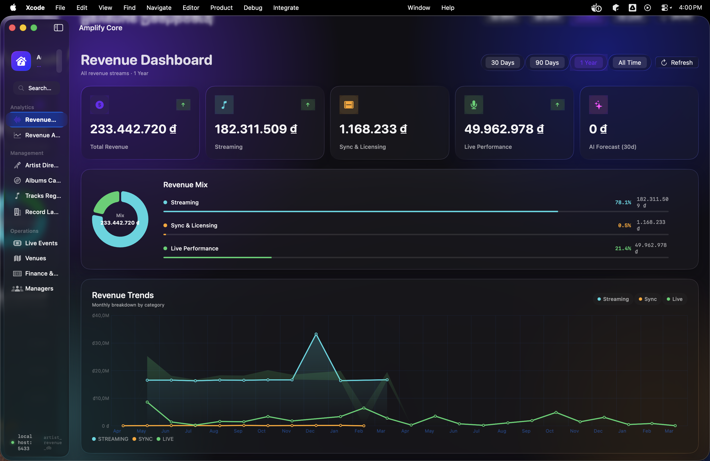
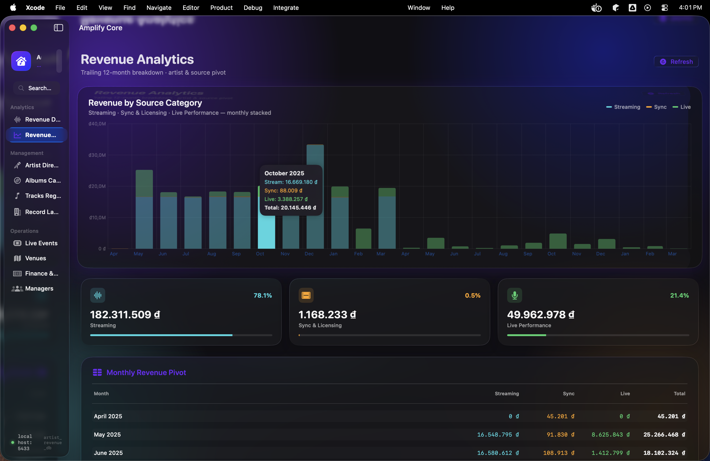
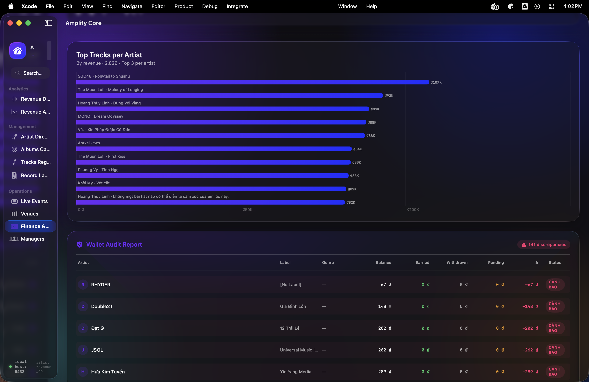
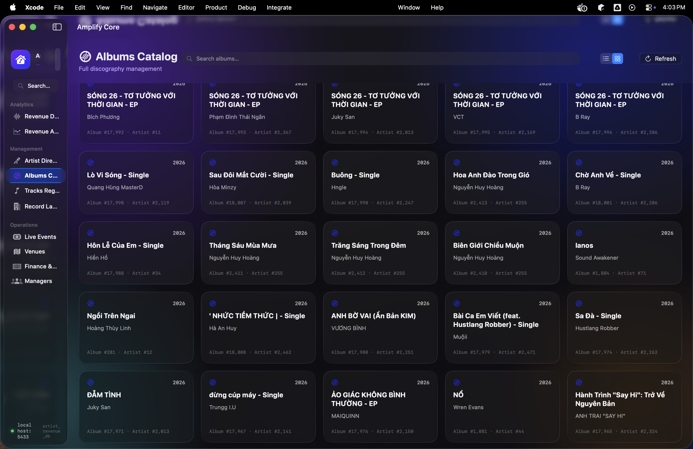
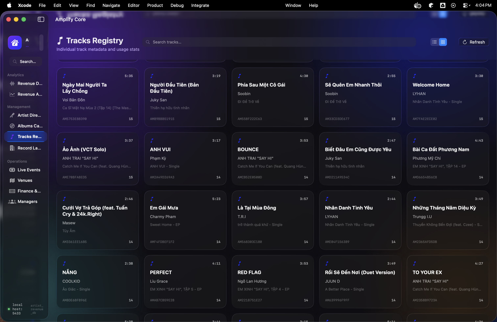
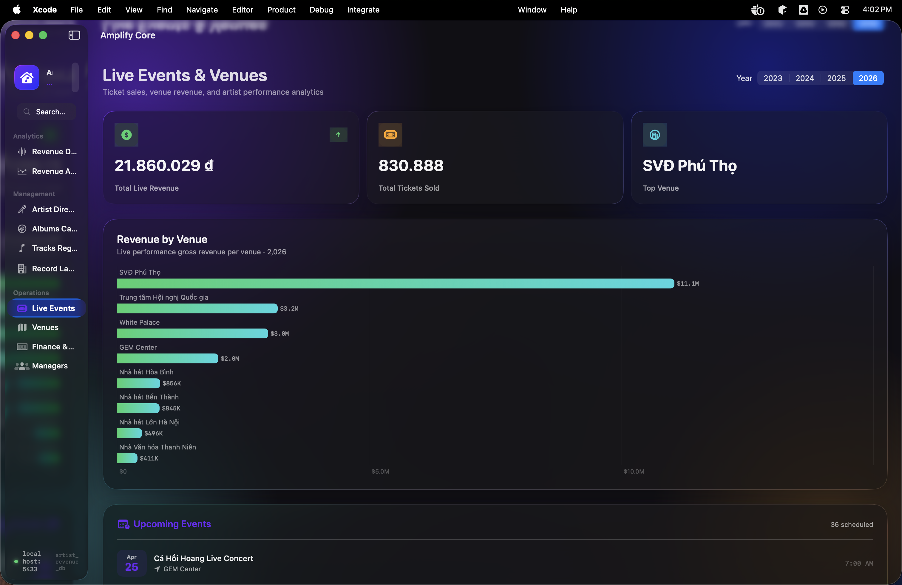

# 🎵 Artist Revenue Management: Enterprise Financial Intelligence



<div align="center">

[](https://www.postgresql.org/)
[](https://developer.apple.com/macos/)
[](https://swift.org/)
[](https://www.docker.com/)
[](LICENSE)

**Architected for Scale. Engineered for Precision.**
*A high-performance financial management ecosystem for music labels and independent artists.*

</div>

---

## 💎 The Vision

Modern music revenue is fragmented across streaming, live performances, and physical sales. This project provides a **unified financial source of truth**. 

Unlike generic accounting software, this system is built on a **Domain-Specific Database Schema** that understands the nuances of artist-label contracts, revenue splits, and automated wallet reconciliations. It leverages a **Liquid Glass UI** for macOS Tahoe, delivering a premium, data-dense, yet visually stunning experience for management professionals.

---

## 🖼️ Experience the Interface

### 📊 Revenue Intelligence & Forecasting
Deep dive into financial performance with multi-dimensional analysis. Powered by PostgreSQL `ROLLUP` and `CUBE` operations, visualized through native SwiftUI Charts with glassmorphism effects.



### 📄 Financial Engineering: Contracts & Splits
Manage complex legal agreements with automated split logic. The system ensures transactional integrity during revenue distribution across multiple stakeholders.



### 💿 Inventory Management: Albums & Tracks
A comprehensive catalog system that tracks metadata, ownership, and performance metrics at a granular level.

<div align="center">
  
  
</div>

### 🎤 Operations: Live Events & Venues
Real-time tracking of performance revenue, venue bookings, and logistical coordination.



---

## 🏗️ Technical Architecture

### 🗄️ Database Engineering (The Core)
At the heart of the system is a highly optimized **PostgreSQL 16** cluster, engineered with a Senior DBA mindset:
- **Relational Integrity**: Strict schema enforcement using advanced constraints and triggers to ensure financial consistency.
- **ISA Inheritance Model**: Sophisticated artist classification (Solo vs. Band) using relational inheritance patterns for flexible entity management.
- **Stored Procedure Library**: 15+ specialized procedures for revenue rollups, wallet audits, and contract splits, keeping business logic close to the data for maximum performance.
- **Materialized Views**: Optimized for analytical workloads (OLAP), providing low-latency access to complex financial trends.

### 💻 macOS Native Interface (The Experience)
The **Amplify Core** macOS application implements the **Liquid Glass UI** philosophy:
- **Tahoe-Ready**: Built specifically for macOS 26.0+ utilizing `glassEffect`, `GlassEffectContainer`, and `backgroundExtensionEffect`.
- **Async Data Pipeline**: Leverages `PostgresNIO` for non-blocking, high-performance database communication.
- **SwiftUI 6.0+**: A purely reactive UI that stays synchronized with the database state in real-time.

---

## 📁 Project Structure

```bash
artist-revenue-management/
├── db/                        # 🗄️ Database Layer (Senior DBA Level)
│   ├── migrations/            # Versioned DDL (V1..V10) for core entities & ISA
│   ├── procedures/            # Business logic: Revenue rollups, splits, audits
│   └── seeds/                 # High-fidelity mock data for stress testing
├── macos-swiftui-app/         # 💻 Desktop Layer (Liquid Glass UI)
│   ├── Sources/               # Native Swift implementation
│   └── Package.swift          # SPM configuration with PostgresNIO
├── etl/                       # 🔄 Data Integration
│   └── pipeline/              # Ingestion scripts for external revenue sources
├── app/                       # 📊 Legacy Web Portal (Streamlit Dashboard)
├── docs/                      # 📝 Technical Specification
│   ├── physical-design.md     # Indexing strategy and storage optimization
│   └── logical-design.md      # Normalized ERD and relationship mapping
└── docker-compose.yml         # Containerized infrastructure orchestration
```

---

## 🚀 Deployment & Initialization

### Prerequisites
- **Docker & Docker Compose**
- **macOS 26.0+ (Tahoe)** (for the native desktop app)
- **Xcode 16+**

### 1. Spin up the Database Cluster
```bash
docker compose up -d
```
*This initializes the PostgreSQL 16 instance, applies all migrations, and deploys the stored procedures automatically.*

### 2. Build the macOS Application
```bash
cd macos-swiftui-app
swift build -c release
```

---

## 🛠️ Tech Stack

| Component | Technology |
| :--- | :--- |
| **Engine** | PostgreSQL 16 + pgvector |
| **Connectivity** | PostgresNIO (Async Swift) |
| **Desktop App** | SwiftUI + Liquid Glass (macOS Tahoe) |
| **Infrastructure** | Docker, Docker Compose, Makefile |
| **Analytics** | SQL Stored Procedures, Materialized Views |

---

## 📞 Industry Contact

For enterprise inquiries or implementation support:
- **Architecture Lead**: [Your Name/Handle]
- **Project Repository**: https://github.com/khang3004/artist-revenue-management-project

---
*© 2026 Artist Revenue Management Systems. All rights reserved.*
